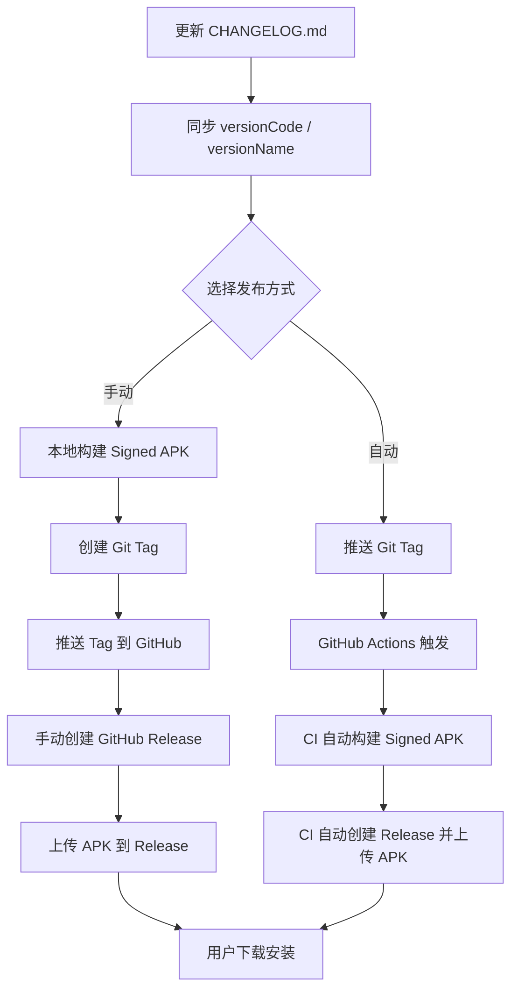
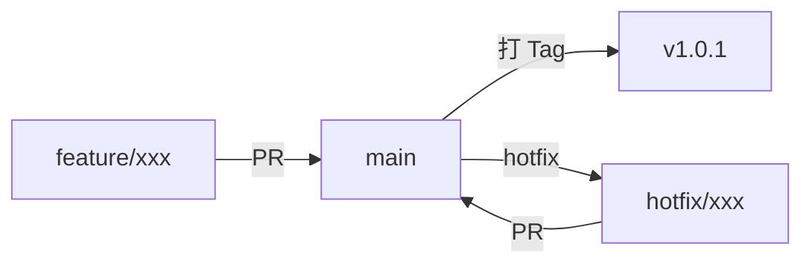

# FakeOCAT 发布指南

> 本文档详细介绍从源码构建到 GitHub Release 发布的完整流程，涵盖手动方式与自动化 CI/CD 方案。

---

## 目录

- [第一章：概述](#第一章概述)
- [第二章：本地生成 APK（手动方式）](#第二章本地生成-apk手动方式)
- [第三章：手动上传到 GitHub Release](#第三章手动上传到-github-release)
- [第四章：自动化 — GitHub Actions 自动构建和发布](#第四章自动化--github-actions-自动构建和发布)
- [第五章：版本管理最佳实践](#第五章版本管理最佳实践)
- [第六章：常见问题与排错](#第六章常见问题与排错)

---

## 第一章：概述

### 1.1 发布流程概览

FakeOCAT 的发布流程分为两大路径：**手动发布**和 **自动化发布**。核心步骤如下：

1. **准备阶段**：更新 [`CHANGELOG.md`](../CHANGELOG.md)，同步 [`app/build.gradle.kts`](../app/build.gradle.kts) 中的 `versionCode` / `versionName`
2. **构建阶段**：生成签名的 Release APK
3. **发布阶段**：创建 Git Tag，上传 APK 到 GitHub Release
4. **通知阶段**：用户从 Release 页面下载安装

### 1.2 流程图



### 1.3 项目关键信息

| 配置项 | 值 |
|---|---|
| applicationId | `com.example.fakeocat` |
| 当前 versionCode | `1` |
| 当前 versionName | `1.0` |
| CHANGELOG 最新版本 | `1.0.1` |
| compileSdk | `35` |
| minSdk | `24` |
| targetSdk | `35` |
| Gradle 版本 | `9.5.0` |
| AGP 版本 | `9.2.1` |
| Kotlin 版本 | `2.2.10` |
| JDK 要求 | `21+`（Gradle 9.x 最低要求） |

> ⚠️ **注意**：当前 [`app/build.gradle.kts`](../app/build.gradle.kts:14) 中的 `versionCode = 1`、`versionName = "1.0"` 与 [`CHANGELOG.md`](../CHANGELOG.md:10) 中记录的 `1.0.1` 不同步。发布前必须先修正。

---

## 第二章：本地生成 APK（手动方式）

### 2.1 使用 Android Studio 生成 Signed APK

#### 步骤一：打开构建向导

1. 在 Android Studio 菜单栏中依次点击 **Build** → **Generate Signed Bundle / APK...**
2. 在弹出的对话框中选择 **APK**（如果需要发布到 Google Play 则选择 Android App Bundle）
3. 点击 **Next**

#### 步骤二：配置签名密钥

1. 如果已有密钥库（keystore），点击 **Choose existing...** 选择文件
2. 如果没有密钥库，点击 **Create new...** 创建新的签名密钥（详见 [2.3 生成签名密钥](#23-生成签名密钥keytool-命令)）
3. 填写以下信息：
   - **Key store path**：密钥库文件路径
   - **Password**：密钥库密码
   - **Key alias**：密钥别名
   - **Key password**：密钥密码
4. 点击 **Next**

#### 步骤三：选择构建类型

1. 选择 **release** 构建变体
2. 勾选签名版本（建议同时勾选 **V1** 和 **V2**）
3. 点击 **Finish**

#### 步骤四：获取 APK

构建完成后，Android Studio 会在右下角弹出通知。点击 **locate** 即可打开 APK 所在目录，默认路径为：

```
app/release/app-release.apk
```

### 2.2 使用命令行生成 APK

在项目根目录下执行以下命令：

```bash
# 授予 gradlew 执行权限（仅首次需要，macOS / Linux）
chmod +x gradlew

# 构建未签名的 Release APK（仅用于测试）
./gradlew assembleRelease

# 构建签名的 Release APK（需要先配置 signingConfigs，见 2.4）
./gradlew assembleRelease
```

构建成功后，APK 文件位于：

```
app/build/outputs/apk/release/app-release-unsigned.apk   # 未签名
app/build/outputs/apk/release/app-release.apk             # 已签名（配置了 signingConfigs）
```

> 💡 **提示**：如果未配置 `signingConfigs`，生成的 APK 为未签名版本，无法直接安装到设备上。

### 2.3 生成签名密钥（keytool 命令）

使用 Java 自带的 `keytool` 工具生成签名密钥：

```bash
keytool -genkeypair \
  -v \
  -keystore fakeocat-release.jks \
  -keyalg RSA \
  -keysize 2048 \
  -validity 10000 \
  -alias fakeocat
```

执行后会提示输入以下信息：

| 提示 | 说明 | 示例 |
|---|---|---|
| Enter keystore password | 密钥库密码 | `your_keystore_password` |
| Re-enter new password | 确认密码 | `your_keystore_password` |
| What is your first and last name? | 姓名（可填应用名） | `FakeOCAT` |
| What is the name of your organizational unit? | 组织单位 | `Development` |
| What is the name of your organization? | 组织名称 | `Example` |
| What is the name of your City or Locality? | 城市 | `Tokyo` |
| What is the name of your State or Province? | 省份 | `Tokyo` |
| What is the two-letter country code? | 国家代码 | `JP` |
| Is CN=FakeOCAT, ... correct? | 确认信息 | `yes` |

> ⚠️ **重要**：密钥库文件（`.jks`）和密码必须妥善保管。一旦丢失，将无法对已发布的 APK 进行签名更新，用户将不得不卸载后重新安装。

建议将密钥库文件存放在项目根目录之外的安全位置，例如：

```
~/keystores/fakeocat-release.jks
```

### 2.4 在 build.gradle.kts 中配置 signingConfigs

编辑 [`app/build.gradle.kts`](../app/build.gradle.kts)，在 `android { }` 块内添加 `signingConfigs` 配置：

```kotlin
plugins {
    alias(libs.plugins.android.application)
    alias(libs.plugins.kotlin.compose)
}

android {
    namespace = "com.example.fakeocat"
    compileSdk = 35

    defaultConfig {
        applicationId = "com.example.fakeocat"
        minSdk = 24
        targetSdk = 35
        versionCode = 2          // ← 发布 1.0.1 时应递增为 2
        versionName = "1.0.1"    // ← 与 CHANGELOG 保持同步

        testInstrumentationRunner = "androidx.test.runner.AndroidJUnitRunner"
        lint {
            checkReleaseBuilds = true
            abortOnError = true
        }
    }

    // ★ 签名配置
    signingConfigs {
        create("release") {
            // 推荐：从环境变量读取（本地开发时可在 gradle.properties 或环境变量中设置）
            storeFile = file(System.getenv("KEYSTORE_FILE") ?: "../keystores/fakeocat-release.jks")
            storePassword = System.getenv("KEYSTORE_PASSWORD") ?: ""
            keyAlias = System.getenv("KEY_ALIAS") ?: "fakeocat"
            keyPassword = System.getenv("KEY_PASSWORD") ?: ""
        }
    }

    buildTypes {
        release {
            isMinifyEnabled = true
            isShrinkResources = true
            proguardFiles(
                getDefaultProguardFile("proguard-android-optimize.txt"),
                "proguard-rules.pro"
            )
            // ★ 关联签名配置
            signingConfig = signingConfigs.getByName("release")
        }
    }
    compileOptions {
        sourceCompatibility = JavaVersion.VERSION_17
        targetCompatibility = JavaVersion.VERSION_17
    }
    buildFeatures {
        compose = true
        buildConfig = true
    }
}

dependencies {
    // ... 依赖保持不变
}
```

> 💡 **安全提示**：不要将密钥库密码硬编码在 `build.gradle.kts` 中。推荐使用环境变量或 `local.properties`（已自动被 `.gitignore` 忽略）来管理敏感信息。

### 2.5 验证 APK 签名

使用 Android SDK 自带的 `apksigner` 工具验证 APK 签名：

```bash
# 完整验证
apksigner verify --verbose app/build/outputs/apk/release/app-release.apk
```

预期输出示例：

```
Verifies
Verified using v1 scheme (JAR signing): true
Verified using v2 scheme (APK Signature Scheme v2): true
Verified using v3 scheme (APK Signature Scheme v3): true
Verified using v4 scheme (APK Signature Scheme v4): false
Number of signers: 1
```

如果验证失败，常见原因包括：

- APK 未签名（未配置 `signingConfigs`）
- 使用了 debug 签名而非 release 签名
- 密钥库文件路径错误

---

## 第三章：手动上传到 GitHub Release

### 3.1 创建 Git Tag

在确保所有代码已提交并推送后，创建版本标签：

```bash
# 确保在 main 分支上，且工作区干净
git status

# 创建轻量标签
git tag v1.0.1

# 或者创建带注释的标签（推荐，包含版本说明）
git tag -a v1.0.1 -m "Release v1.0.1: 新增 MiMo Provider 支持，修复多个 Bug"
```

> ⚠️ **Tag 命名规范**：必须以 `v` 开头，例如 `v1.0.1`、`v2.0.0`。这与第四章中 GitHub Actions 的触发条件 `v*` 相匹配。

### 3.2 推送 Tag 到远程

```bash
# 推送指定标签
git push origin v1.0.1

# 或者推送所有本地标签
git push origin --tags
```

### 3.3 在 GitHub 网页上创建 Release 并上传 APK

1. 打开仓库页面，点击 **Releases** 标签
2. 点击 **Draft a new release**（或 **Create a new release**）
3. 在 **Choose a tag** 下拉框中选择刚推送的 `v1.0.1` 标签
4. 填写 **Release title**：`v1.0.1`
5. 在 **Describe this release** 中粘贴 [`CHANGELOG.md`](../CHANGELOG.md) 中对应版本的内容
6. 在 **Attach binaries** 区域，拖拽或选择已构建的 `app-release.apk` 文件
7. 点击 **Publish release**

### 3.4 使用 gh CLI 创建 Release 并上传 APK

GitHub 官方 CLI 工具 `gh` 可以在命令行中完成 Release 创建：

```bash
# 安装 gh CLI（如果尚未安装）
# macOS: brew install gh
# Windows: winget install GitHub.cli
# Linux: 参见 https://github.com/cli/cli/blob/trunk/docs/install_linux.md

# 登录 GitHub（首次需要）
gh auth login

# 从 CHANGELOG.md 中提取 v1.0.1 版本的 Release Notes
# 手动复制对应内容到临时文件
cat > release-notes.md << 'EOF'
## [1.0.1] - 2026-06-14

### Added
- 新增小米 MiMo Provider 支持，基于 OpenAI 兼容协议接入，API 地址 `api.xiaomimimo.com`。
- MiMo 硬编码模型列表：`mimo-v2-flash`、`mimo-v2-pro`。
- MiMo Token Plan 端点支持（`token-plan-cn.xiaomimimo.com`），兼容按量付费与 Token Plan 两种接入方式。

### Fixed
- 修复 Gemini `modelsEndpoint` 使用错误的 `/v1/` 路径，改为正确的 `/v1beta/models`。
- 修复 `NetworkOnMainThreadException`：`LlmClient.streamChatWithProfile()` 中 OkHttp 同步调用未切换到 IO 调度器的问题。
- 修复 SSE 流式解析中 `JSONObject.optString()` 将 JSON `null` 返回为字符串 `"null"` 导致的异常。
- 过滤推理模型（如 MiMo）的 `reasoning_content` 思考过程，不再显示给用户。
- 首 token 超时从 5 秒增大到 15 秒，兼容 Gemini 等 API 的冷启动场景。
- 改进错误消息：不再显示 "Unknown error"，改为显示具体异常类型名。
- 改进流结束无数据时的兜底错误消息。
- 修复 MiMo API 域名（从 `api.mimogpt.com` 改为 `api.xiaomimimo.com`）。
EOF

# 创建 Release 并上传 APK
gh release create v1.0.1 \
  --title "v1.0.1" \
  --notes-file release-notes.md \
  app/build/outputs/apk/release/app-release.apk#app-release.apk
```

> 💡 **提示**：`gh release create` 的最后一个参数格式为 `文件路径#显示名称`，`#` 后面的部分是用户在 Release 页面看到的文件名。

---

## 第四章：自动化 — GitHub Actions 自动构建和发布

### 4.1 配置 GitHub Secrets

自动化发布需要将签名密钥存储在 GitHub 仓库的 Secrets 中。以下是详细步骤：

#### 步骤一：将密钥库文件编码为 Base64

```bash
# macOS / Linux
base64 -i fakeocat-release.jks | tr -d '\n'

# Windows PowerShell
[Convert]::ToBase64String([IO.File]::ReadAllBytes("fakeocat-release.jks")) -replace "`n",""
```

将输出的 Base64 字符串完整复制备用。

#### 步骤二：在 GitHub 仓库中添加 Secrets

1. 打开仓库页面 → **Settings** → **Secrets and variables** → **Actions**
2. 点击 **New repository secret**，逐个添加以下四个 Secret：

| Secret 名称 | 值 | 说明 |
|---|---|---|
| `KEYSTORE_BASE64` | 上一步输出的 Base64 字符串 | 密钥库文件的 Base64 编码 |
| `KEYSTORE_PASSWORD` | 你的密钥库密码 | 创建密钥库时设置的密码 |
| `KEY_ALIAS` | `fakeocat` | 密钥别名 |
| `KEY_PASSWORD` | 你的密钥密码 | 创建密钥时设置的密码（通常与 KEYSTORE_PASSWORD 相同） |

> ⚠️ **安全提醒**：Secrets 添加后无法再次查看其值。请确保在本地妥善记录密码。Secrets 对具有仓库写权限的用户可见（通过 CI 日志间接暴露的风险由 GitHub 自动防护）。

### 4.2 完整的 release.yml 工作流文件

创建文件 [`.github/workflows/release.yml`](../.github/workflows/release.yml)：

```yaml
name: Release

# ── 触发条件 ──
on:
  # 推送以 v 开头的 Tag 时自动触发
  push:
    tags:
      - 'v*'
  # 支持手动触发（可指定 tag）
  workflow_dispatch:
    inputs:
      tag:
        description: '要发布的版本 Tag（例如 v1.0.1）'
        required: true
        type: string

# 撤销同一流水线的旧运行（例如连续推送多个 tag 时）
concurrency:
  group: release-${{ github.ref }}
  cancel-in-progress: true

env:
  # 覆盖 gradle.properties 中硬编码的本地 JDK 路径
  org.gradle.java.home: ''

jobs:
  release:
    name: Build & Release
    runs-on: ubuntu-latest
    permissions:
      contents: write   # 创建 Release 并上传 Asset 所需

    steps:
      # ── 1. 确定发布版本号 ──
      - name: 解析版本号
        id: version
        run: |
          if [ "${{ github.event_name }}" = "workflow_dispatch" ]; then
            TAG="${{ github.event.inputs.tag }}"
          else
            TAG="${GITHUB_REF#refs/tags/}"
          fi
          echo "tag=$TAG" >> "$GITHUB_OUTPUT"
          # 去掉 v 前缀得到纯版本号
          echo "version=${TAG#v}" >> "$GITHUB_OUTPUT"

      # ── 2. 检出代码 ──
      - name: 检出代码
        uses: actions/checkout@v4
        with:
          ref: ${{ steps.version.outputs.tag }}

      # ── 3. 设置 JDK 21 ──
      # Gradle 9.x 要求最低 JDK 21；compileOptions 中的 Java 17 目标与之兼容
      - name: 设置 JDK 21
        uses: actions/setup-java@v4
        with:
          java-version: '21'
          distribution: 'temurin'

      # ── 4. 安装 Android SDK ──
      - name: 安装 Android SDK
        uses: android-actions/setup-android@v3
        with:
          packages: 'platforms;android-35'

      # ── 5. 配置 Gradle 缓存 ──
      - name: 配置 Gradle
        uses: gradle/actions/setup-gradle@v4

      # ── 6. 解码并写入签名密钥 ──
      - name: 解码签名密钥
        env:
          KEYSTORE_BASE64: ${{ secrets.KEYSTORE_BASE64 }}
        run: |
          echo "$KEYSTORE_BASE64" | base64 -d > ${{ github.workspace }}/keystore.jks

      # ── 7. 构建签名 Release APK ──
      - name: 授予 gradlew 执行权限
        run: chmod +x gradlew

      - name: 构建 Release APK
        env:
          KEYSTORE_FILE: ${{ github.workspace }}/keystore.jks
          KEYSTORE_PASSWORD: ${{ secrets.KEYSTORE_PASSWORD }}
          KEY_ALIAS: ${{ secrets.KEY_ALIAS }}
          KEY_PASSWORD: ${{ secrets.KEY_PASSWORD }}
        run: ./gradlew assembleRelease

      # ── 8. 提取 CHANGELOG 中对应版本的 Release Notes ──
      - name: 提取 Release Notes
        id: notes
        run: |
          VERSION="${{ steps.version.outputs.version }}"
          # 使用 awk 提取 [x.y.z] 到下一个 ## 之间的内容
          awk -v ver="$VERSION" '
            /^\[/ && index($0, "[" ver "]") > 0 { found=1; next }
            found && /^\[/ { exit }
            found { print }
          ' CHANGELOG.md > release-notes.md

          # 如果提取结果为空，使用默认文本
          if [ ! -s release-notes.md ]; then
            echo "Release ${{ steps.version.outputs.tag }}" > release-notes.md
          fi

      # ── 9. 创建 GitHub Release 并上传 APK ──
      - name: 创建 GitHub Release
        uses: softprops/action-gh-release@v2
        with:
          tag_name: ${{ steps.version.outputs.tag }}
          name: ${{ steps.version.outputs.tag }}
          body_path: release-notes.md
          files: app/build/outputs/apk/release/app-release.apk
          draft: false
          prerelease: false
        env:
          GITHUB_TOKEN: ${{ secrets.GITHUB_TOKEN }}
```

### 4.3 工作流步骤详解

下面逐段解释工作流的每个关键部分：

#### 触发条件

```yaml
on:
  push:
    tags:
      - 'v*'           # 推送 v 开头的 Tag 时触发
  workflow_dispatch:    # 支持在 GitHub 网页上手动触发
```

- **Tag 触发**：当执行 `git push origin v1.0.1` 时自动运行
- **手动触发**：在 Actions 页面点击 **Run workflow**，可指定任意 Tag

#### 权限声明

```yaml
permissions:
  contents: write
```

GitHub Actions 默认使用 `GITHUB_TOKEN`，其权限受到限制。`contents: write` 允许创建 Release 并上传文件。

#### 密钥解码

```yaml
- name: 解码签名密钥
  env:
    KEYSTORE_BASE64: ${{ secrets.KEYSTORE_BASE64 }}
  run: |
    echo "$KEYSTORE_BASE64" | base64 -d > ${{ github.workspace }}/keystore.jks
```

将 Base64 编码的密钥库文件还原为二进制文件。构建完成后该文件不会被保留在 CI 环境中。

#### 签名构建

```yaml
- name: 构建 Release APK
  env:
    KEYSTORE_FILE: ${{ github.workspace }}/keystore.jks
    KEYSTORE_PASSWORD: ${{ secrets.KEYSTORE_PASSWORD }}
    KEY_ALIAS: ${{ secrets.KEY_ALIAS }}
    KEY_PASSWORD: ${{ secrets.KEY_PASSWORD }}
  run: ./gradlew assembleRelease
```

通过环境变量将签名信息传递给 Gradle。这要求 [`app/build.gradle.kts`](../app/build.gradle.kts) 中的 `signingConfigs` 使用 `System.getenv()` 读取（参见 [2.4 配置 signingConfigs](#24-在-buildgradlekts-中配置-signingconfigs)）。

#### Release Notes 提取

```yaml
- name: 提取 Release Notes
  id: notes
  run: |
    VERSION="${{ steps.version.outputs.version }}"
    awk -v ver="$VERSION" '
      /^\[/ && index($0, "[" ver "]") > 0 { found=1; next }
      found && /^\[/ { exit }
      found { print }
    ' CHANGELOG.md > release-notes.md
```

使用 `awk` 从 [`CHANGELOG.md`](../CHANGELOG.md) 中自动提取对应版本的变更记录。例如 Tag 为 `v1.0.1` 时，提取 `[1.0.1]` 到下一个版本标题之间的所有内容。

#### 发布 Release

```yaml
- name: 创建 GitHub Release
  uses: softprops/action-gh-release@v2
  with:
    tag_name: ${{ steps.version.outputs.tag }}
    name: ${{ steps.version.outputs.tag }}
    body_path: release-notes.md
    files: app/build/outputs/apk/release/app-release.apk
```

使用社区维护的 [`softprops/action-gh-release`](https://github.com/softprops/action-gh-release) Action 创建 Release 并上传 APK 附件。

---

## 第五章：版本管理最佳实践

### 5.1 同步 versionCode / versionName 与 CHANGELOG

当前项目存在版本号不同步的问题：

| 文件 | versionCode | versionName |
|---|---|---|
| [`app/build.gradle.kts`](../app/build.gradle.kts:14) | `1` | `1.0` |
| [`CHANGELOG.md`](../CHANGELOG.md:10) | — | `1.0.1` |

#### 推荐的同步流程

每次发布前，按以下顺序更新版本号：

1. **更新 [`CHANGELOG.md`](../CHANGELOG.md)**：将 `[Unreleased]` 下的内容归档到新版本标题下
2. **更新 [`app/build.gradle.kts`](../app/build.gradle.kts)**：
   - `versionName`：与 CHANGELOG 版本号一致（如 `"1.0.1"`）
   - `versionCode`：每次发布递增 1（Google Play 要求单调递增）
3. **提交并打 Tag**

```kotlin
// app/build.gradle.kts
defaultConfig {
    versionCode = 2        // 从 1 递增到 2
    versionName = "1.0.1"  // 与 CHANGELOG 一致
}
```

> 💡 **自动化建议**：可以在 CI 中使用脚本从 Git Tag 自动提取版本号并注入构建，避免手动维护。例如通过 `buildConfigField` 将版本信息写入 `BuildConfig`。

### 5.2 Semantic Versioning 规范简介

FakeOCAT 遵循 [Semantic Versioning（语义化版本）](https://semver.org/spec/v2.0.0.html)规范，版本号格式为 **MAJOR.MINOR.PATCH**：

| 版本段 | 递增时机 | 示例 |
|---|---|---|
| **MAJOR**（主版本） | 不兼容的 API 变更或重大架构重构 | `1.0.0` → `2.0.0` |
| **MINOR**（次版本） | 新增功能，向后兼容 | `1.0.0` → `1.1.0` |
| **PATCH**（补丁版本） | Bug 修复，向后兼容 | `1.0.1` → `1.0.2` |

结合 [`CHANGELOG.md`](../CHANGELOG.md) 中的分类：

- **Added** → 通常对应 MINOR 版本递增
- **Fixed** → 通常对应 PATCH 版本递增
- **Changed / Removed** → 如果有破坏性变更，对应 MAJOR 版本递增

### 5.3 推荐的发布流程

#### 分支策略



- **`main` 分支**：始终保持可发布状态
- **`feature/*` 分支**：开发新功能，完成后通过 PR 合并到 `main`
- **`hotfix/*` 分支**：紧急修复，从 `main` 创建，修复后 PR 合并回 `main`

#### 完整发布流程（PR 模式）

```bash
# 1. 确保在最新 main 分支上
git checkout main
git pull origin main

# 2. 更新 CHANGELOG.md
# 将 [Unreleased] 下的内容移到新版本标题下

# 3. 更新 app/build.gradle.kts 中的版本号
# versionCode += 1
# versionName = "新版本号"

# 4. 提交版本更新
git add CHANGELOG.md app/build.gradle.kts
git commit -m "chore: bump version to 1.0.1"

# 5. 创建并推送 Tag
git tag -a v1.0.1 -m "Release v1.0.1"
git push origin main
git push origin v1.0.1

# 6. 如果配置了 GitHub Actions，CI 会自动构建并发布 Release
# 7. 如果未配置 CI，在 GitHub 网页上手动创建 Release 并上传 APK
```

#### Tag 命名规范

| 格式 | 示例 | 用途 |
|---|---|---|
| `v{MAJOR}.{MINOR}.{PATCH}` | `v1.0.1` | 正式发布 |
| `v{MAJOR}.{MINOR}.{PATCH}-rc.{N}` | `v2.0.0-rc.1` | 候选发布（测试用） |
| `v{MAJOR}.{MINOR}.{PATCH}-beta.{N}` | `v2.0.0-beta.1` | Beta 测试 |

---

## 第六章：常见问题与排错

### 6.1 签名相关问题

#### Q：安装 APK 时提示「安装包解析错误」或「INSTALL_FAILED_INVALID_APK」

**原因**：APK 未签名，或使用了 debug 签名。

**解决方案**：

1. 确认 [`app/build.gradle.kts`](../app/build.gradle.kts) 中已配置 `signingConfigs`
2. 使用 `apksigner verify` 检查签名状态
3. 确认构建命令为 `./gradlew assembleRelease` 而非 `assembleDebug`

#### Q：安装时提示「INSTALL_FAILED_UPDATE_INCOMPATIBLE」

**原因**：设备上已安装的 APK 使用了不同的签名密钥。

**解决方案**：

- 卸载设备上的旧版本后重新安装
- 确保使用相同的密钥库进行签名

#### Q：忘记密钥库密码

**结果**：无法恢复。必须使用新的密钥库重新签名，这意味着用户需要卸载旧版本后重新安装。

**预防措施**：

- 将密钥库文件和密码存储在安全的密码管理器中
- 定期备份密钥库文件
- 考虑使用 Google Play App Signing（如果发布到 Play Store）

### 6.2 CI 构建失败的常见原因

#### Q：`Execution failed for task ':app:validateSigningRelease'`

**原因**：签名配置缺失或环境变量未设置。

**解决方案**：

1. 检查 GitHub Secrets 是否已正确配置全部四个变量
2. 确认 [`app/build.gradle.kts`](../app/build.gradle.kts) 中 `signingConfigs` 使用 `System.getenv()` 读取环境变量
3. 检查 CI 日志中环境变量是否为空（注意：Secrets 值不会直接输出到日志）

#### Q：`Could not determine the dependencies of task ':app:compileReleaseJavaWithJavac'`

**原因**：Android SDK 组件缺失。

**解决方案**：确认 CI 工作流中包含 SDK 安装步骤：

```yaml
- name: 安装 Android SDK
  uses: android-actions/setup-android@v3
  with:
    packages: 'platforms;android-35'
```

#### Q：`Unsupported class file major version 65` 或类似的 JDK 版本错误

**原因**：JDK 版本与 Gradle / AGP 不兼容。

**解决方案**：

- Gradle 9.x 要求 JDK 21+
- 确认 `setup-java` 步骤使用 `java-version: '21'`
- [`gradle.properties`](../gradle.properties) 中被注释的 `org.gradle.java.home` 指向本地路径，CI 中通过 `env: org.gradle.java.home: ''` 覆盖

#### Q：`./gradlew: Permission denied`

**原因**：`gradlew` 脚本没有执行权限。

**解决方案**：在 CI 中添加执行权限步骤：

```yaml
- name: 授予 gradlew 执行权限
  run: chmod +x gradlew
```

#### Q：ProGuard / R8 混淆导致运行时崩溃

**常见症状**：Release 版本闪退，Debug 版本正常。

**解决方案**：

1. 检查 [`app/proguard-rules.pro`](../app/proguard-rules.pro) 是否包含必要的 keep 规则
2. 查看 `app/build/outputs/mapping/release/mapping.txt` 获取混淆映射
3. 使用 `retrace` 工具还原崩溃堆栈

### 6.3 如何处理版本号冲突

#### Q：`versionCode` 重复（Google Play 场景）

**原因**：已上传过相同 `versionCode` 的 APK。

**解决方案**：

- 将 `versionCode` 递增到一个更大的值
- 建议使用 CI 脚本自动递增，或使用时间戳作为 `versionCode`（如 `20260614`）

#### Q：Git Tag 已存在

```
fatal: tag 'v1.0.1' already exists
```

**解决方案**：

```bash
# 方案 A：删除本地和远程的旧 Tag，重新创建
git tag -d v1.0.1
git push origin :refs/tags/v1.0.1
git tag -a v1.0.1 -m "Release v1.0.1"
git push origin v1.0.1

# 方案 B：使用新的 Patch 版本号
git tag -a v1.0.2 -m "Release v1.0.2"
git push origin v1.0.2
```

> ⚠️ **注意**：如果已有用户基于旧 Tag 的 Release 安装了 APK，删除并重新创建 Tag 可能导致混乱。建议优先使用方案 B（递增版本号）。

#### Q：CHANGELOG 版本号与 build.gradle.kts 不一致

**解决方案**：建立发布前检查清单（Checklist），确保以下项目全部更新：

- [ ] [`CHANGELOG.md`](../CHANGELOG.md) 中新版本标题与日期
- [ ] [`app/build.gradle.kts`](../app/build.gradle.kts) 中 `versionName` 与 CHANGELOG 一致
- [ ] [`app/build.gradle.kts`](../app/build.gradle.kts) 中 `versionCode` 已递增
- [ ] Git Tag 格式正确（`v` 前缀 + 版本号）

---

> 📝 **文档维护说明**：本文档随项目发布流程的变更而更新。如有疑问或建议，请在项目 Issue 中提出。
